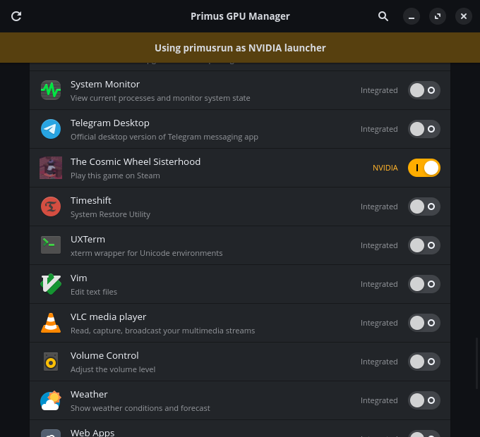

<div align="center">


# Primus GPU Manager

**Per-app GPU switcher for NVIDIA Primus on Linux**

[](../../releases/latest)
[](LICENSE)
[]()
[]()

</div>

---

Primus GPU Manager lets you choose which GPU each application uses — no terminal needed. Toggle between the integrated GPU (for battery saving) and the NVIDIA dGPU (for performance) on a per-app basis, with changes taking effect the next time you launch the app.

<div align="center">

</div>

---

## Requirements

| Dependency | Purpose | Install (Debian/Ubuntu) |
|---|---|---|
| Python 3.10+ | Runtime | usually pre-installed |
| GTK 4 + python3-gi | UI toolkit | `sudo apt install python3-gi gir1.2-gtk-4.0` |
| Libadwaita | Adwaita widgets | `sudo apt install gir1.2-adw-1` |
| `primusrun` or `prime-run` | NVIDIA launcher | `sudo apt install nvidia-primus-vk-wrapper` |

> Package names above use `apt` because the app has been tested on Debian-based systems (Debian, Ubuntu). On Fedora use `dnf`, on Arch use `pacman` — package names may differ.

> If neither `primusrun` nor `prime-run` is found, the app still works using environment variable fallback (`__NV_PRIME_RENDER_OFFLOAD=1`), though this may not work on all driver versions.

---

## Installation

### Flatpak — `PrimusGPUManager.flatpak` (recommended)

Download from the [latest release](../../releases/latest).

**Graphically:** double-click the `.flatpak` file and use GNOME Software, Discover, or any compatible app store to install it.

**Terminal:**
```bash
flatpak install --user PrimusGPUManager.flatpak
flatpak run io.github.primus-gpu-manager
```

After installation it will appear in your app launcher as **Primus GPU Manager**.

---

### AppImage — `PrimusGPUManager-x86_64.AppImage`

Download from the [latest release](../../releases/latest). The filename includes the architecture (`x86_64`).

**Graphically:** make the file executable (right-click → Properties → Permissions → Allow executing as program), then double-click it. Tools like [Gear Lever](https://flathub.org/apps/it.mijorus.gearlever) or [AppImageLauncher](https://github.com/TheAssassin/AppImageLauncher) can integrate it into your app launcher automatically.

**Terminal:**
```bash
chmod +x PrimusGPUManager-x86_64.AppImage
./PrimusGPUManager-x86_64.AppImage
```

> Requires FUSE on some systems: `sudo apt install fuse libfuse2`

---

### From source

```bash
git clone https://github.com/cuyo-pixel/primus-gpu-manager.git
cd primus-gpu-manager
python3 gpu_manager.py
```

---

## How it works

When you toggle an app to **NVIDIA**, Primus GPU Manager creates a user-local copy of its `.desktop` file at `~/.local/share/applications/` and prepends the NVIDIA launcher to the `Exec=` line:

```ini
# Before
Exec=zen-browser %u

# After (with primusrun)
Exec=primusrun zen-browser %u
```

The original system file is never modified. Toggle back to **Integrated** to revert. No root required, no reboot needed.

---

## Usage

1. Open **Primus GPU Manager** from your app launcher
2. Find the app using the search button if needed
3. Toggle the switch — **Integrated** (grey, default) or **NVIDIA** (green)
4. The change takes effect the next time you launch that app

Use the **↺** refresh button in the header after installing new software to pick up newly added apps.

---

## Uninstall

**Flatpak:**
```bash
flatpak uninstall io.github.primus-gpu-manager
```

**AppImage:** delete the `.AppImage` file. No files are written to the system.

In both cases, any `.desktop` overrides written to `~/.local/share/applications/` remain. To clean those up:

```bash
grep -rl "# gpu-manager: nvidia" ~/.local/share/applications/ | xargs rm -f
```

---

## Compatibility

| Distro | Status |
|---|---|
| PikaOS 4 | ✅ Tested |
| Ubuntu 24.04+ | ✅ Should work |
| Debian Bookworm+ | ✅ Should work |
| Pop!\_OS 22.04+ | ✅ Should work |
| Fedora 40+ | ⚠️ Untested — use `dnf` for dependencies |
| Arch Linux | ⚠️ Untested — use `pacman` for dependencies |

Requires NVIDIA Optimus (hybrid graphics). Not useful on systems with a single GPU.

---

## Known issues (v0.5 beta)

- App count may differ slightly in the Flatpak version depending on which Flatpak exports are visible at launch — use the reload button if an app is missing
- Some Electron apps override GPU selection internally and may ignore the launcher prefix

---

## Contributing

Issues and PRs welcome. This is an early beta — bug reports with your distro, driver version, and desktop environment are especially helpful.

---

## AI statement

This project was developed with assistance from **Claude Sonnet** (Anthropic), used for code review, bug hunting, and translation of comments and documentation. All logic, writing, design decisions, and testing were done by the author.

---

## License

MIT © 2026
